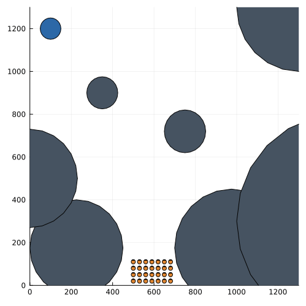
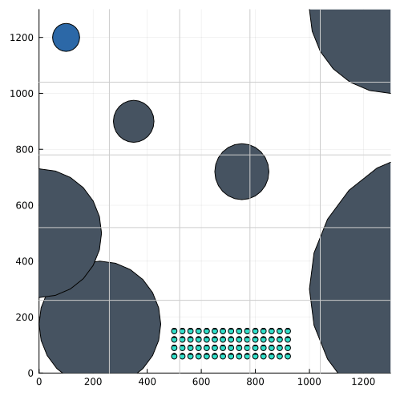
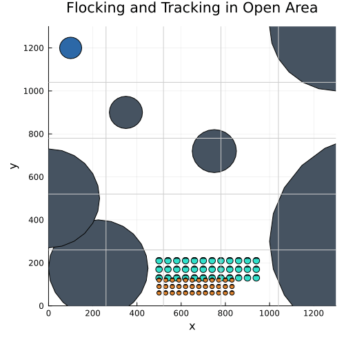

# Mobile Robot Agent Simulation

This repository hosts a simulation of an agent-based model featuring mobile robots navigating within a bounded environment. The simulation incorporates "realistic" (not yet fully) physics to ensure accurate movement and interactions between robots and the environment. In the future this simulation should be used to simulate a search and rescue mission employing a robot swarm in an environment with multiple obstacles. A distributed RL aglorithm should be used to optimize this environment.

## Current Features

* **Realistic Movement:** Robots move in a physically accurate manner. Collisions and interactions with the environment borders are handled according to physics principles.
* **Environment Boundaries:** The simulation environment is bounded by borders.
* Obstacles can be placed in the bounded environment.
* Sensoric Data: Robots are equipt with infrared sensors in each direction to get information of nearby obstacles or robots

## Future Features

* Improved collision handling of multiple robots
* Every Robot has a heat camera to find the target in a search and rescue szenario
* Nearby robots can exchange information

# Swarm Behaviour

For this robot simulation two swarming algorithms are implemented.

## Tracking

Currently the algorithm is single target, but will be extended to track multiple targets of a swarm.

## Flocking

## Search and Rescue

To allow for search and rescue missions in environment without long range communication, these algorithms are combined. This allows for fast transmission of the target location, without retracing the traveled path.

